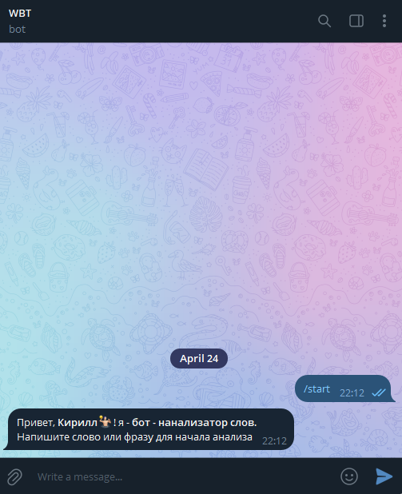

# Telegram WBT

Telegram Word Bot - это простой инструмент, который анализирует текстовое сообщение, отправленное пользователем, 
и выдает различные характеристики слова, такие как количество букв, количество гласных, количество согласных, уникальные буквы и наиболее часто встречающиеся буквы.

## Установка и запуск

### По этой сыылке вы можете запустить бота: https://t.me/WBTYaBot
Отправляйте текстовые сообщения: Бот анализирует текстовые сообщения, которые вы отправляете. Просто введите слово, 
которое вы хотите проанализировать, и бот вернет вам информацию о слове.
Используйте английский язык: Бот был разработан для работы с английским языком, поэтому он может не распознавать 
или неправильно интерпретировать слова на других языках.

## Пример работы бота 

## Команды бота

`/start` - Запускает бота

`/hi` - Позволяет пользователю поприветствовать бота

`/help` - Предоставляет пользователю помощь по использованию бота

